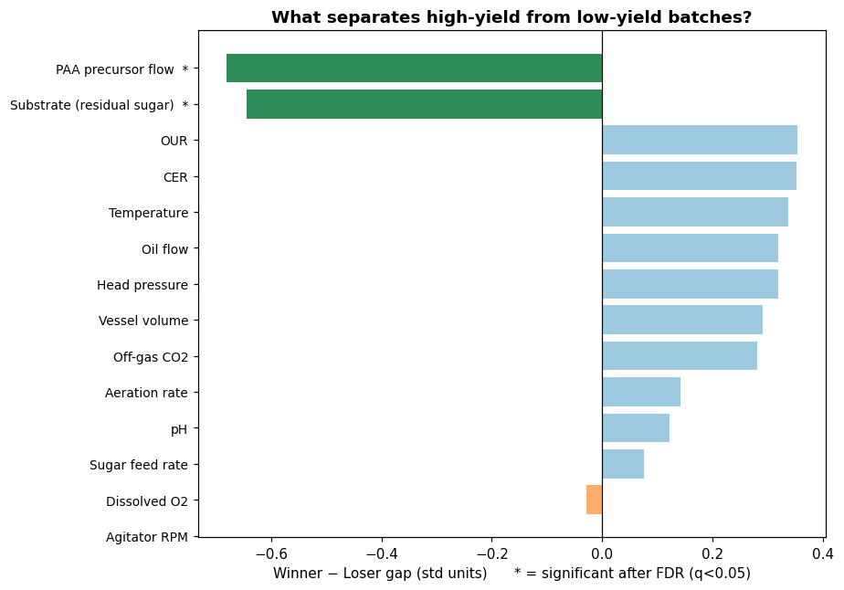
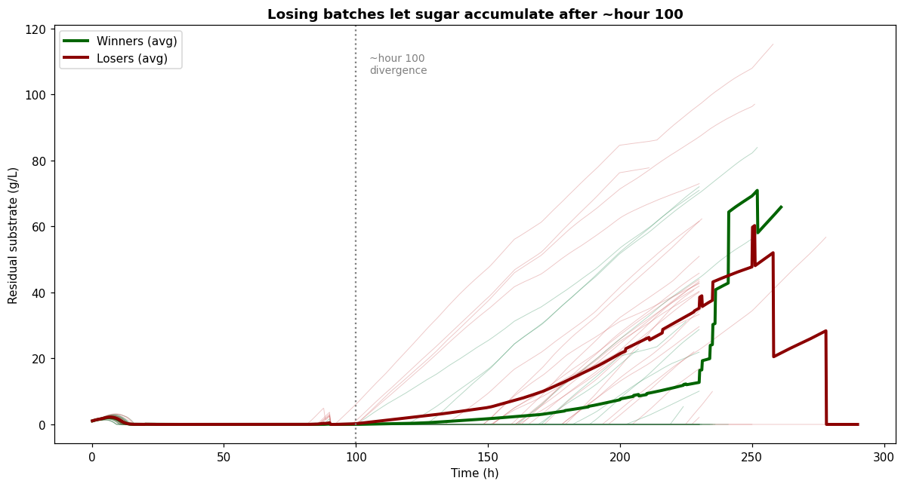
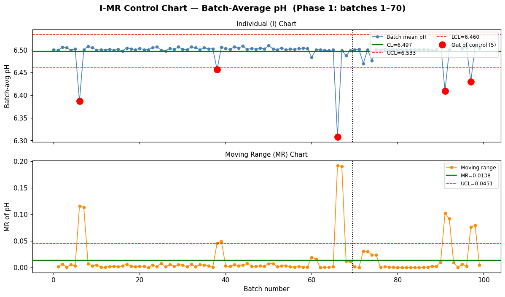

# Statistical Process Control & Root-Cause Analytics for Penicillin Fermentation

A reproducible **Python** pipeline that turns raw bioprocess time-series into a
data-driven answer: *which fermentation batches underperform, when they diverge, and
which process parameter to act on.* Built on **IndPenSim V3**, a high-fidelity simulation
of 100 industrial-scale (100,000 L) penicillin fed-batch fermentations.

`Statistical Process Control (SPC)` · `Process Capability (Cpk/Ppk)` · `Root Cause Analysis`
· `Bioprocess / Fermentation Engineering` · `Continued Process Verification (CPV)`
· `Python` · `pandas` · `SciPy` · `Pharmaceutical Manufacturing`

> **Note:** IndPenSim V3 is a published *simulator* (Goldrick et al.). Using simulated
> data means we have **ground-truth fault labels** to validate against — a luxury real
> plant data rarely offers, and something this project uses deliberately.

---

## TL;DR — key results

- **Found the yield driver:** residual **glucose (substrate)** is the parameter that
  separates high- from low-yield batches — statistically significant after
  **Benjamini-Hochberg FDR correction** across 14 parameters (**q ≈ 0.003**), matching the
  known mechanism of glucose catabolite repression.
- **Pinpointed the timing:** good and bad batches are indistinguishable until **~hour 100**,
  after which losers let sugar accumulate — a concrete process-intervention window.
- **Ruled out the usual suspects:** an **I-MR control chart** shows pH held within
  **±0.04 pH units** batch-to-batch, eliminating pH and temperature as drivers.
- **Caught my own error:** the original yield metric (last-logged concentration)
  correlated only **0.36** with true harvested mass; correcting it **overturned a
  spurious "feed-rate" conclusion**.
- **Reported honest performance:** validated the bad-batch detector against ground-truth
  faults (**recall 0.60**) and the alarm threshold on a **held-out split (68% accuracy)**,
  not an inflated in-sample number.

---

## Visual results

**1. What separates winners from losers** (winner−loser gap in std units; `*` = significant after FDR)



**2. When they diverge** — losing batches let residual sugar climb after ~hour 100



**3. Ruling out pH** — I-MR control chart shows pH is practically stable (limits span only ±0.04 pH units)



---

## The question

> Turn 100 batches of raw fermentation data into an answer:
> *which batches went wrong → when → why → and what should the operator do?*

## Pipeline architecture

A single shared **data loader (the spine)** that every analysis stage imports — one place
that decides "which column is the batch ID" and "what is the yield target," so the stages
can never disagree.

```
 V3 time-series CSV  +  Statistics CSV (harvested mass + fault labels)
                     │
                     ▼
          step0_data_loader.py         ← spine: memory-safe load, batch ID,
                     │                    yield_kg (target), fault (labels)
     ┌───────────────┼───────────────┬──────────────────┐
     ▼               ▼               ▼                  ▼
 step1_data_    step2_root_     step3_control_     step4_trajectory.py
 integrity.py   cause.py        chart.py           (optional)
 (quality gate  (WHAT / WHEN /  (I-MR chart +
  + capability)  validation)     Nelson rules)
```

| Step | File | Job |
|---|---|---|
| 0 | `step0_data_loader.py` | Loads only needed columns (Parquet-cached), picks the batch ID, builds `yield_kg`, `final_pen`, `fault`. |
| 1 | `step1_data_integrity.py` | Data-quality gate: batch count, physical-range checks, capability (Cpk/Ppk) + normality test. |
| 2 | `step2_root_cause.py` | Part A *what* separates winners/losers (Mann-Whitney U + FDR); Part B *when* (substrate timing + holdout-validated alarm); Part C *validation* vs fault labels. |
| 3 | `step3_control_chart.py` | I-MR control chart on batch-mean pH with the full Nelson run-rule set. |
| 4 | `step4_trajectory.py` | *(optional)* penicillin accumulation curves + "golden batch" reference. |
| 5 | `step5_archive_shewhart.py` | *(retired)* a Shewhart-on-yield chart that failed — kept as an honest record of a wrong turn. |

## Tech stack

| Layer | Tool |
|---|---|
| Language | Python 3 |
| Data | pandas, NumPy, Parquet (pyarrow) for memory-safe loading of a 2.5 GB dataset |
| Statistics | SciPy — Mann-Whitney U, Shapiro-Wilk; Benjamini-Hochberg FDR (implemented) |
| Visualization | matplotlib |

## Methodology highlights

- **Right chart for the data:** each batch reduces to one summary value, so the correct
  tool is the **I-MR (Individuals & Moving Range)** chart, not X-bar (which needs
  subgroups). Limits from Phase 1, monitored in Phase 2, with **Nelson run rules**.
- **Capability done correctly:** reports both **Ppk** (overall σ) and **Cpk**
  (within-subgroup σ = MR̄/d₂), with a Shapiro-Wilk normality caveat — the two are
  routinely confused.
- **Statistical rigor:** non-parametric testing for small, skewed samples, plus
  **multiple-comparison (FDR) correction** so 14 simultaneous tests don't manufacture
  false positives (pH's raw p = 0.02 correctly does *not* survive correction).
- **No overfitting:** the alarm threshold is derived on a train split and scored on
  held-out batches.

## Data

The dataset is **IndPenSim** (Industrial-scale Penicillin Simulation) by Stephen Goldrick
et al., a first-principles model of a 100,000 L *Penicillium chrysogenum* fermentation
validated against historical industrial data.

- **Download:** [industrialpenicillinsimulation.com](http://www.industrialpenicillinsimulation.com/)
  — the full 100-batch dataset with process + Raman measurements (~2.5 GB).
- **Mirror / DOI:** [Mendeley Data — `pdnjz7zz5x`](https://data.mendeley.com/datasets/pdnjz7zz5x/2)
- **Paper:** Goldrick et al., *"Modern day monitoring and control challenges outlined on an
  industrial-scale benchmark fermentation process,"* Computers & Chemical Engineering
  ([UCL Discovery](https://discovery.ucl.ac.uk/id/eprint/10082538/)).

Place `100_Batches_IndPenSim_V3.csv` and `100_Batches_IndPenSim_Statistics.csv` in the repo
root before running. (The large V3 file is git-ignored — download it separately.)

**How the 100 batches are structured** (worth knowing when interpreting the results):
batches 1–30 are recipe-driven, 31–60 operator-controlled, 61–90 use Advanced Process
Control with Raman, and **91–100 contain injected faults**. So batch-to-batch yield
variation partly reflects different control strategies, not pure random noise — which is
exactly why this project validates its findings against the ground-truth fault labels.

## Run it

```bash
pip install pandas numpy scipy matplotlib pyarrow

python step1_data_integrity.py     # data quality + capability
python step2_root_cause.py         # WHAT drives yield, WHEN it diverges, validation
python step3_control_chart.py      # I-MR control chart on pH
python step4_trajectory.py         # (optional) accumulation curves
```

Each script is self-contained and imports `step0_data_loader` automatically. Place
`100_Batches_IndPenSim_V3.csv` and `100_Batches_IndPenSim_Statistics.csv` in the repo root.

## Operating recommendation (the engineering takeaway)

1. **Feed to demand** — match sugar feed to consumption so residual glucose stays near
   zero (a glucose-limited culture is the penicillin-producing state).
2. **Hour-100 checkpoint** — batches look identical before this point; from here, alarm on
   rising residual substrate (using a validated cutoff).
3. **Watch live gauges** — OUR and off-gas CO₂ read culture health in real time.
4. **Act on accumulation, not gauges** — trim the feed if sugar rises; don't chase OUR/CO₂,
   which are symptoms.

## Limitations (and how I'd harden it)

- **Association, not proof** — observational comparison, not a designed experiment; a
  confirmatory feed-strategy trial would close the loop.
- **PAA flow** is statistically significant but likely *coupled* to the feed-control scheme
  rather than an independent lever — flagged for follow-up, not acted on.
- **Alarm rule is fragile** — the midpoint threshold is split-dependent (~68% holdout); a
  learned cutoff (logistic regression / Youden's J) should replace it.

## Learn the theory

`STUDY_GUIDE.md` walks through every concept (SPC, I-MR, Cpk/Ppk, FDR, catabolite
repression) at an explain-it-to-someone level, with the real code outputs annotated.
